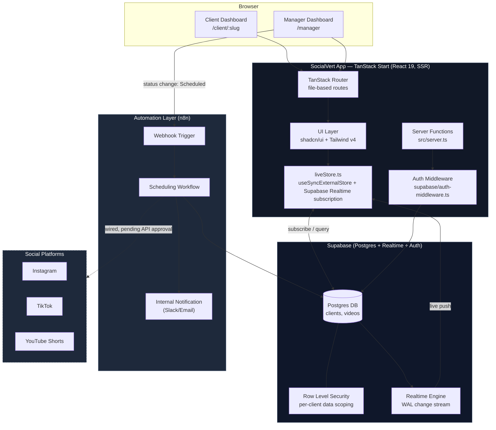
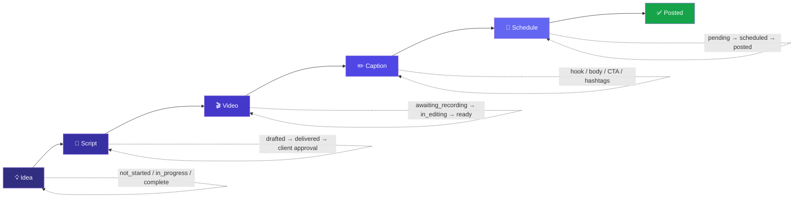
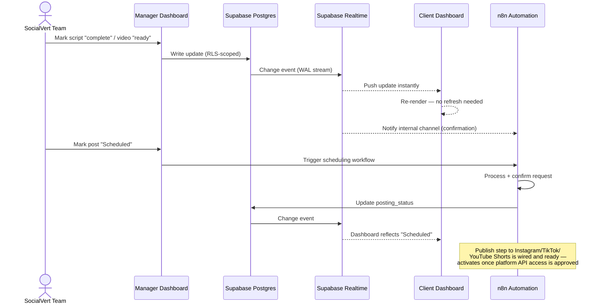
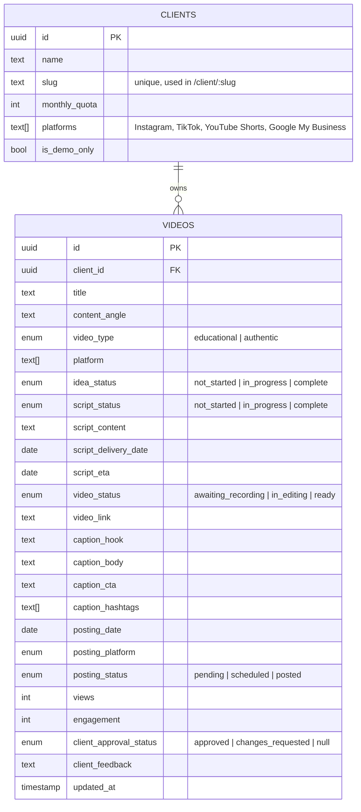

# SocialVert — Client Content Dashboard

A real-time content operations platform built for SocialVert to give clients full visibility into their content pipeline, and give the internal team a single place to manage delivery across every stage — from idea to published post.

**Live demo:** [https://social-vert.netlify.app/](https://social-vert.netlify.app/)

---

## Table of Contents

- [What This Is](#what-this-is)
- [The Experience](#the-experience)
- [System Architecture](#system-architecture)
- [Content Pipeline](#content-pipeline)
- [Real-Time Data Flow](#real-time-data-flow)
- [Data Model](#data-model)
- [Tech Stack](#tech-stack)
- [Project Structure](#project-structure)
- [Data Isolation & Access Model](#data-isolation--access-model)
- [Getting Started](#getting-started)
- [Environment Variables](#environment-variables)
- [What's Next](#whats-next)
- [Author](#author)

---

## What This Is

SocialVert manages content production for 40+ clients every month. Before this, clients had no way to see where their content stood without reaching out directly. This dashboard solves that by giving every client a live, always-current view of their content pipeline, and giving the SocialVert team a streamlined system to manage that pipeline without manual status updates or spreadsheets.

Every video moves through five tracked production stages — **Idea → Script → Video → Caption → Schedule** — and every status change made by the internal team is reflected on the client's dashboard instantly, with no manual syncing, refreshing, or status-update messages required.

---

## The Experience

### For Clients

Each client logs into their own dedicated dashboard showing exactly where their content stands, with no technical knowledge required to understand it.

| Feature | What it does |
|---|---|
| **Monthly Quota Tracker** | A clear visual of how many videos are planned, completed, in progress, and remaining for the month |
| **Pipeline Status Board** | Every video shown moving through all five production stages, color-coded so progress is instantly obvious |
| **Scripts Library** | Clients read every finalized script, see delivery dates and upcoming ETAs, and approve or request changes directly from the dashboard |
| **Video Library** | Every video with its current status, with an embedded preview so clients can watch content without leaving the dashboard |
| **Captions & Hashtags** | Full caption breakdown (hook, body, CTA, hashtags) per video, with inline editing so clients can adjust copy themselves |
| **Content Calendar** | A real calendar view of what's posting, when, and on which platform, with statuses that update automatically |
| **Performance Analytics** | Views, engagement, top-performing platform, and top-performing posts |

Every section reflects live data. When the SocialVert team updates something internally, the client sees it update on their own dashboard in real time.

### For the SocialVert Team

A single manager dashboard to run content operations for every client from one place.

- Full client roster with at-a-glance completion tracking across the entire client base
- Per-client content management: create video ideas, write and finalize scripts, update production status, add captions, and schedule posts
- One-click scheduling that immediately triggers the automation layer — the moment a post is scheduled, it's picked up by the system and queued for publishing
- Account-level analytics across all clients: platforms connected, plan utilization, completion rates, and recent activity

---

## System Architecture



**Deployment:** the app is built with Vite/Nitro and deployed as a static + SSR hybrid on **Netlify**. Supabase hosts the Postgres database, Row Level Security, Auth, and the Realtime engine. **n8n** runs the automation layer that reacts to status changes and (once platform API approvals land) will handle the actual publish step to Instagram, TikTok, and YouTube Shorts.

---

## Content Pipeline

Every video in the system moves through five stages. The pipeline board (client-facing) and the manager tools (internal) both operate on the same underlying record, so there's never a sync step between what the team does and what the client sees.



Each stage carries its own status enum in the data model (see [Data Model](#data-model)), and the client can leave approval feedback (`approved` / `changes_requested`) directly on the script stage.

---

## Real-Time Data Flow

This is the core of the system: nothing on the client dashboard requires manual syncing.



In short: content moves from "idea" to "posted" with the data updating itself at every step, and the client never has to ask "where's my content?" because the answer is always already on their screen.

---

## Data Model



Each client is scoped by a unique `slug` used as their private dashboard URL (`/client/:slug`), and every video is tied to exactly one `client_id` — the boundary that Row Level Security enforces at the database layer.

---

## Tech Stack

| Layer | Technology |
|---|---|
| **Framework** | [TanStack Start](https://tanstack.com/start) (React 19, full-stack SSR) |
| **Routing** | TanStack Router (file-based, type-safe) |
| **Data fetching / cache** | TanStack Query |
| **Styling** | Tailwind CSS v4 + [shadcn/ui](https://ui.shadcn.com/) (Radix primitives) |
| **Charts** | Recharts |
| **Database / Backend** | [Supabase](https://supabase.com/) (Postgres, Row Level Security, Auth, Realtime) |
| **Automation** | [n8n](https://n8n.io/) — event-driven workflows for scheduling & internal notifications |
| **Build tooling** | Vite + Nitro (server bundling) |
| **Deployment** | [Netlify](https://www.netlify.com/) |
| **Language** | TypeScript |

---

## Project Structure

```
src/
├── routes/                    # File-based TanStack Router routes
│   ├── index.tsx               # Landing / entry point
│   ├── client-login.tsx        # Client auth entry
│   ├── client.$slug.tsx        # Client dashboard (per-client, slug-scoped)
│   ├── manager-login.tsx       # Manager auth entry
│   ├── manager.tsx             # Internal team dashboard
│   └── __root.tsx               # Root layout, meta tags, error boundary
│
├── components/sv/              # SocialVert-specific UI
│   ├── DashboardShell.tsx      # Shared shell/nav for both dashboards
│   ├── StageTracker.tsx        # 5-stage pipeline visual
│   ├── QuotaRing.tsx           # Monthly quota progress ring
│   ├── CalendarBoard.tsx       # Content calendar view
│   ├── VideoEmbed.tsx          # Inline video preview
│   ├── VideoActionsBar.tsx     # Approve / request changes actions
│   ├── PlatformIcon.tsx        # Platform badges (IG/TikTok/YT/Google)
│   └── StatusBadge.tsx         # Status pill component
│
├── components/ui/              # shadcn/ui primitives
│
├── lib/
│   ├── liveStore.ts             # Supabase-backed live store (subscriptions + queries)
│   ├── store.ts                 # Store interface shared across UI
│   ├── mockData.ts              # Fallback/demo data + stage derivation logic
│   ├── types.ts                  # Core domain types (Client, Video, Stage, etc.)
│   └── theme.ts                  # Theming
│
├── integrations/supabase/
│   ├── client.ts                 # Browser Supabase client (anon key)
│   ├── client.server.ts          # Server-only Supabase client (service role)
│   ├── auth-middleware.ts        # Request-level auth handling
│   └── types.ts                   # Generated DB types
│
├── server.ts                    # SSR server entry
└── router.tsx                    # Router + QueryClient wiring

supabase/
└── config.toml                   # Supabase project config
```

---

## Data Isolation & Access Model

- Each client accesses their dashboard through a unique, private slug-based URL (`/client/:slug`) tied specifically to their account.
- Every query is scoped to that client's `client_id` — a client can never see another client's videos, scripts, or analytics.
- The browser client (`client.ts`) uses Supabase's public anon key and is subject to Row Level Security; the service-role client (`client.server.ts`) is server-only and never shipped to the browser, used exclusively for trusted admin operations inside server functions.

---

## Getting Started

```bash
# install dependencies
bun install     # or: npm install

# start the dev server
bun dev         # or: npm run dev

# production build
bun run build   # or: npm run build

# preview the production build locally
bun run preview # or: npm run preview
```

## Environment Variables

Create a `.env` file with:

```bash
VITE_SUPABASE_URL=your-supabase-project-url
VITE_SUPABASE_PUBLISHABLE_KEY=your-supabase-anon-key

# server-only (never exposed to the client)
SUPABASE_URL=your-supabase-project-url
SUPABASE_SERVICE_ROLE_KEY=your-supabase-service-role-key
```

---

## What's Next

- Connect the live publish step directly to Instagram, TikTok, and YouTube Shorts once platform API approvals are in place — the automation workflow is already wired for this.
- Add authenticated login in place of unique slug-based links, for an extra layer of access control.
- Extend the same automation pattern to pull from tools like Airtable or ClickUp, if the internal team prefers managing content there instead of directly in this dashboard.

---

## Author

**Shaik Fhiroj** — AI Automation Engineer
[LinkedIn](https://www.linkedin.com/in/fhiroj-shaik-020760355/)
